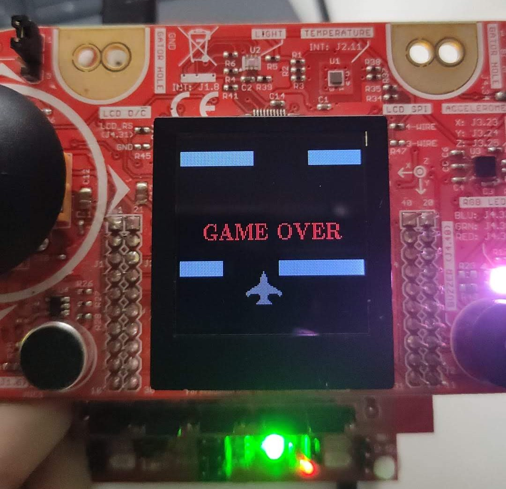

<div align="center">

# 🎮 Imminent Crash! - MSP430 Arcade Game

 

[](https://www.ti.com/product/MSP430G2553)
[](https://en.wikipedia.org/wiki/C_(programming_language))
[]()

</div>

---

**Imminent Crash!** is an arcade-style dodging game developed for the **MSP430G2553** microcontroller. The objective is to control a plane using a joystick and dodge incoming walls to achieve the highest score possible.

This project manages to create a complete arcade-style game using various peripherals and a microcontroller with limited resources.

## 🚀 Features

| Feature | Description |
| :--- | :--- |
| **Dynamic Gameplay** | Fast-paced dodging mechanics with increasing difficulty. |
| **LCD Graphics** | Interactive UI using the Crystalfontz 128x128 ST7735 display. |
| **Persistent Highscore** | Game scores are saved in Flash memory (`0x1000`) to persist after reboot. |
| **UART Interface** | Serial console (115200 baud) for instructions, menu, and logs. |
| **Audio System** | Musical themes and sound effects generated via PWM and a buzzer. |
| **Visual Feedback** | RGB LED indicators for different game states. |

## 🛠️ Hardware Requirements

The project relies on the **TI MSP430G2553** microcontroller and the **Educational BoosterPack MKII**.


| Component | Function |
| :--- | :--- |
| **MSP430G2553** | The brain of the operation. |
| **Crystalfontz ST7735** | 128x128 Pixel Display for game graphics. |
| **Analog Joystick** | Player input (ADC10, Channel 0). |
| **Buzzer** | Sound effects generator (PWM). |
| **RGB LED** | Status indicator. |
| **USB-to-UART** | Serial communication bridge. |


## 💻 Software Architecture

The system is built upon a robust **Finite State Machine (FSM)** ensuring reliable game flow control:

- 🟢 **`inicio`**: Welcome screen with theme music.
- ⚙️ **`opciones`**: Configuration menu (Sound, Reset, Levels).
- 🗺️ **`mapas`**: Environment selection.
- ✈️ **`juego`**: Core loop (Input, Physics, Collision, Rendering).
- 💀 **`muerte`**: Game Over sequence and auto-save highscore.

### Tech Stack
- **Timer Interrupts**: Precision timing for music and physics.
- **ADC Sampling**: Smooth asynchronous joystick polling.
- **Direct Flash Access**: Custom drivers for persistent data storage.

## 🕹️ Controls

### Keyboard (Serial Console)
| Key | Action |
| :---: | :--- |
| `Enter` | Start / Continue |
| `Space` | Open Map Menu |
| `m` | **Mute** Sound |
| `s` | **Enable** Sound |
| `r` | **Reset** Highscore |
| `h` | View **Highscore** |

### Joystick
- **Left / Right**: Move the Plane ✈️

## 📂 Project Structure

```text
├── docs/           # 📄 Technical reports and presentations
├── media/          # 🖼️ Assets, images and demos
└── src/            # 💾 Source code
    ├── main.c      # Main game logic
    ├── grlib/      # Graphics Library
    └── HAL/        # Hardware Abstraction Layer
```

## 📄 Documentation

For a deep dive into the engineering behind *Imminent Crash!*, check out our docs:

- 📘 [**Technical Report (PDF)**](docs/Imminent_Crash_FernandoRoman_MartaBarroso.pdf)
- 📊 [**Presentation Slides (PDF)**](docs/presentacion_imminent_crash.pdf)

## 🎥 Demonstration

<div align="center">

### Watch the Gameplay

<a href="media/Video_demostracion.mp4">
  
</a>

*(Click the image above to play the video)*

</div>

## 👥 Authors

- **Fernando Román**
- **Marta Barroso**

---
<div align="center">
  <i>Developed as part of the Electronic Systems course.</i>
</div>
